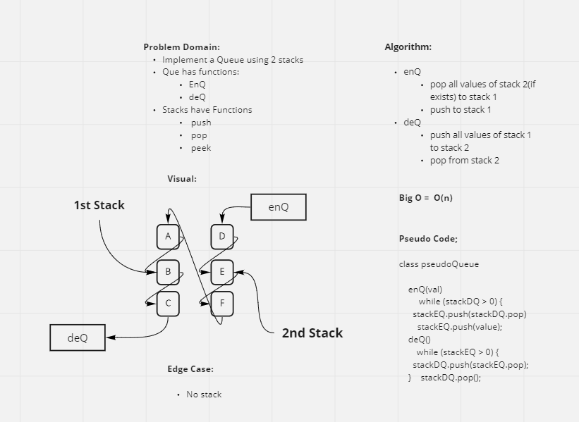

# Stacks and Queues
<!-- This is a test of the Stacks and Queues data methods and their primary methods-->

## Challenge
<!-- Create a stack and a Queue and be able to call methods on both data structures -->

## Approach & Efficiency
<!--Approach was to create a node class and then create a stack and queue class and pull them into my index where I could run methods off of them. Most methods have a Big O notation of O1 -->

## API
<!--Publicly available methods used in this project were push, pop, and shift.-->

## Psuedo Queue
**added 3/29/2021**
<!--Added psuedoQueue() with an Enqueue and Dequeue method that uses 2 stacks that invert on each method in order to out put the right item.-->

## Fifo Animal Shelter
**Added 4/5/21**

<!--Added the AnimalShelter class which allows a user to go in and add dogs and cats to a new Queue method and enqueue or dequeue based off of whether a value is a dog or a cat. This demonstrates how you can use several Queues inside of a higher Queue method in order to separate data.-->

