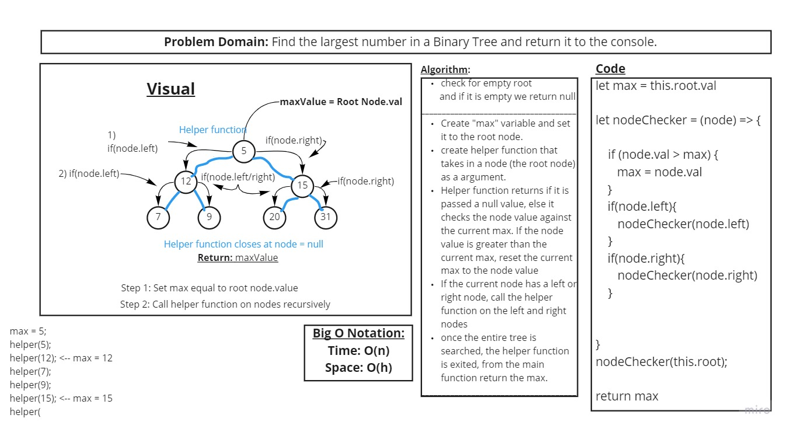
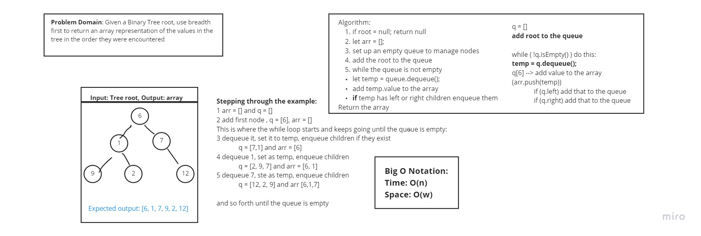

# Binary Tree & Binary Search Tree

This is a build out of a tree structure and its major methods, included in this is also the build out of a binary search tree (The primary difference of which is the adding of data into specific positions.)

## Challenge
 Create a binary tree and the methods: PreOrder, PostOrder, and inOrder as well as the add method on a BST(Binary Search Tree). 

## API
 Publicly available methods used in this data structure are push primarily when tracking the methods in an array format. 

## LargestNumber method
Created a method to search through a binary tree and return the largest value in the tree.

## BreadthFirst Binary search
 Created a breadth first method that searches through a tree and adds items top to bottom left to right across the entire tree.

## FizzBuzz Tree
Pair Programmed with Jenner Dulce and Mark Duenas