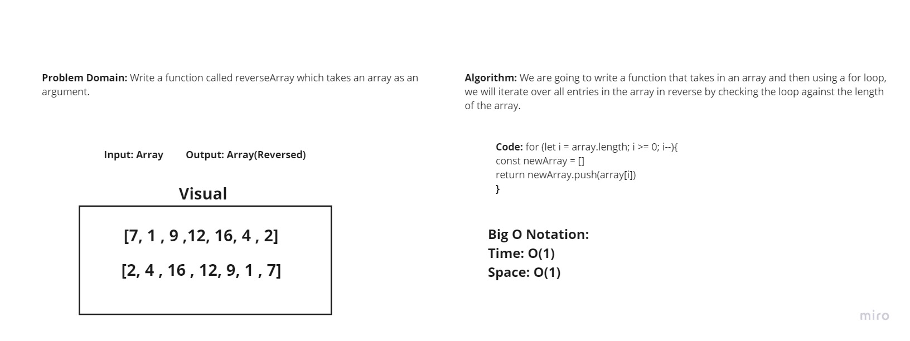

# Array Reversal Method

## Challenge - 
Write a function that takes in an array and reverses it without using the built in reverse method.

## Approach -
The best way to approach this Code Challenge is to use a for loop in reverse order and send all the items in the first array into a new array that is returned.

## Solution -
A reverse for Loop

## Whiteboard -
