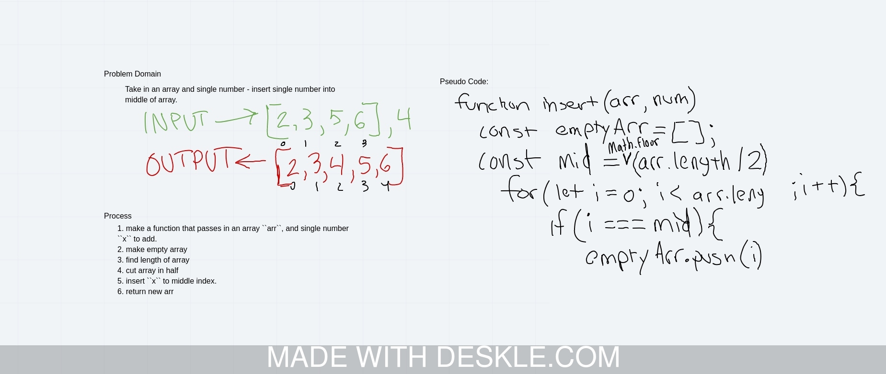

#  Insterted Shift Array

**Problem Domain**: Write a function called insertShiftArray which takes in an array and the value to be added. Without utilizing any of the built-in methods available to your language, return an array with the new value added at the middle index.

## Challenge

## Approach & Efficiency

- Identify the array that you will be manipulating
- Identify the middle of the array with arr.length and divide by 2
- Push items from the Array in until you get to the center point
- Insert number at middle point of array
- Push the rest of the items into the Array

Solution

