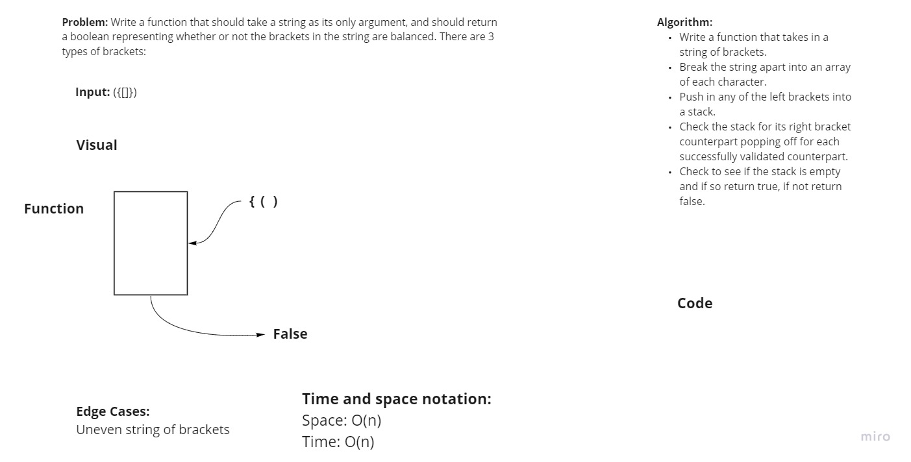

## Multi Bracket Validation

### Programmer: Terrence Simms

##### Challenge:
**Create an algorithm that takes in a set of brackets and returns whether they are balanced true or false.**

##### Approach:
**Created an algorithm that would push all of the left brackets into a stack and then check them against the right brackets to see if each corresponding bracket matched**

##### API:
**Methods used were all of the created commands associated with the Stack Data Structure**

##### Whiteboard:
