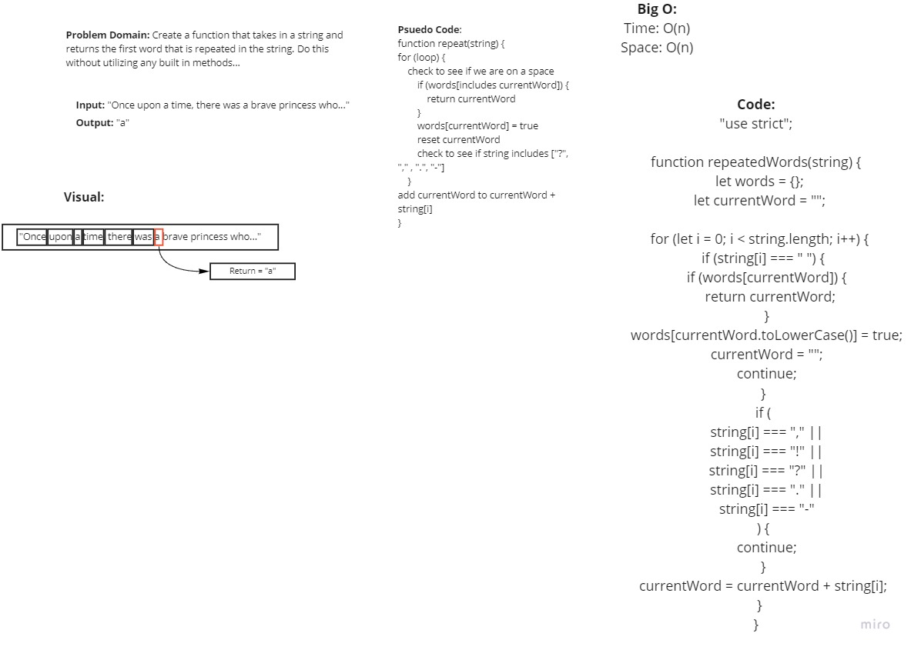

# Problem Domain:
Write a function that takes in a string and then prints out the first word in that string that is repeated.

## Approach:

- Create a for loop that will look over every letter of the string.

- apply each letter of the string to a variable.

- Push the value into an object on " " spaces found.

- Check each new value against values currently present in the object.

- Return when an identical value is found.

Worked alongside Mark, Jenner, and Arthur for this challenge.

