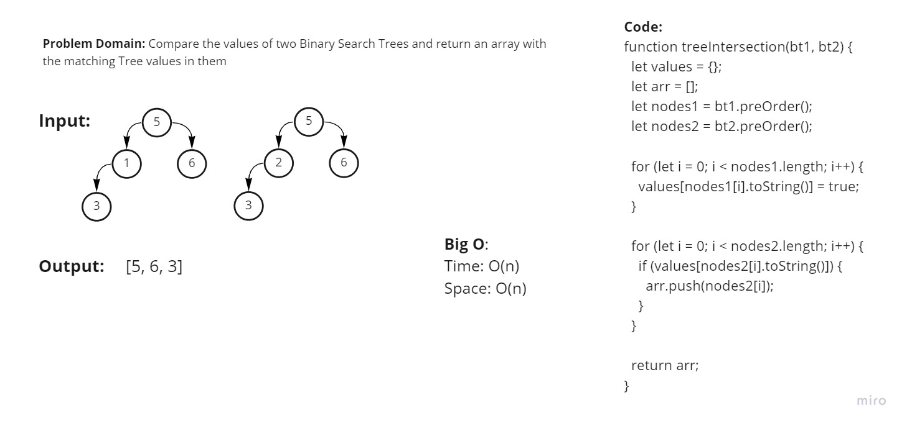

# Problem Domain: 

Write a function that compares the values in 2 given trees and prints out an array with identical values found in each tree.

## Approach:

- Using an order method print out the values from the first tree.

- Push those values into an object.

- Use that object to compare to the values of the second tree.

- Push values found to be identical to those of the object into the Array.

